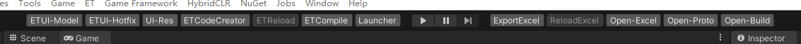

# Unity Toolbar

可以扩展Unity Toolbar的工具



### 安装方式：
- Open Package Manager and Add package from git URL https://github.com/XuToWei/ToolbarExtension.git.

## 使用说明：

在编辑器函数上添加啊Toolbar特性即可

```csharp
[Toolbar(OnGUISide.Left, 0)]
static void OnToolbarGUI()
{
    if (GUILayout.Button(“Test))
    {
        Debug.Log("Test");
    }
}
```


